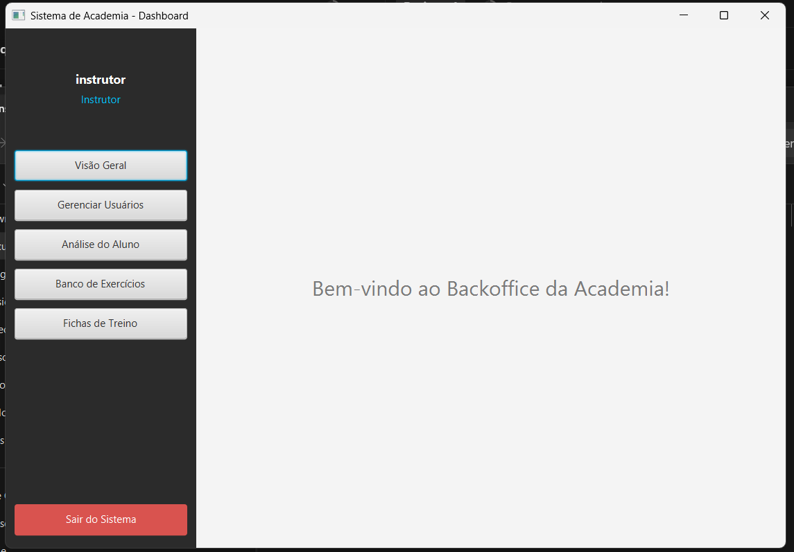
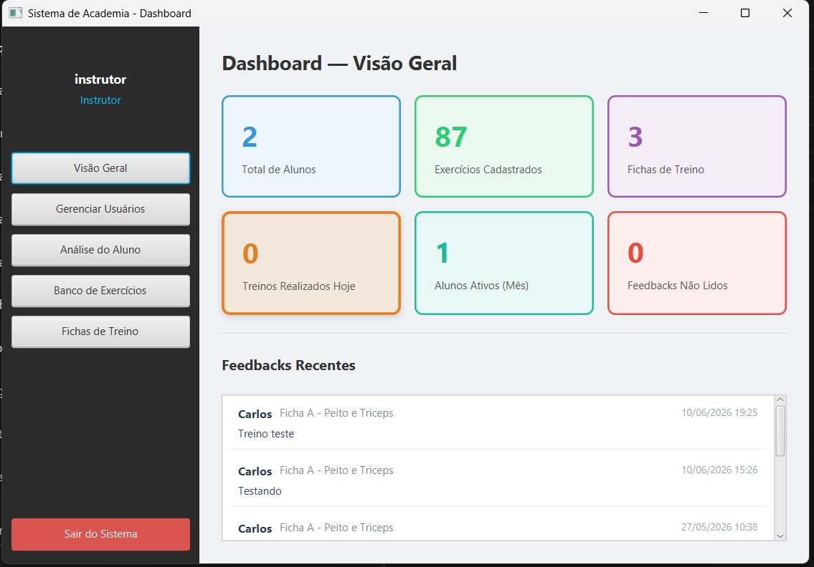
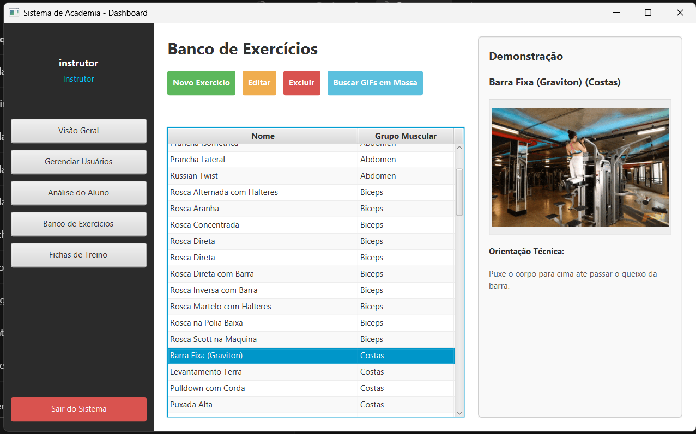
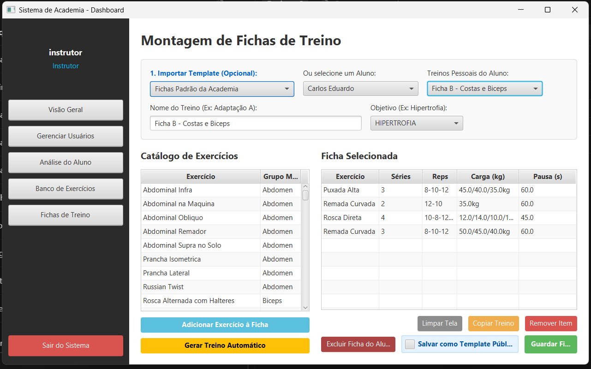
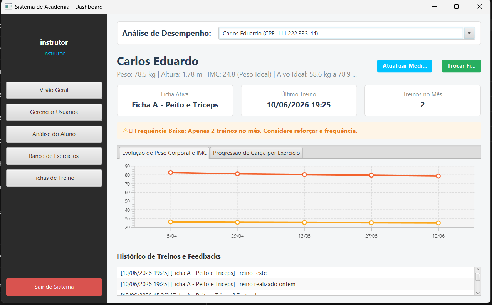
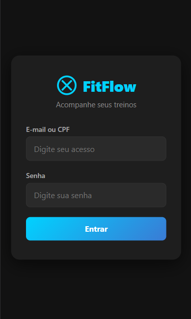
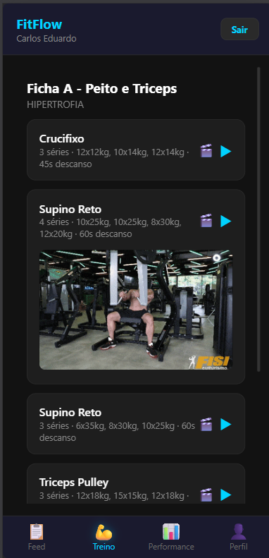
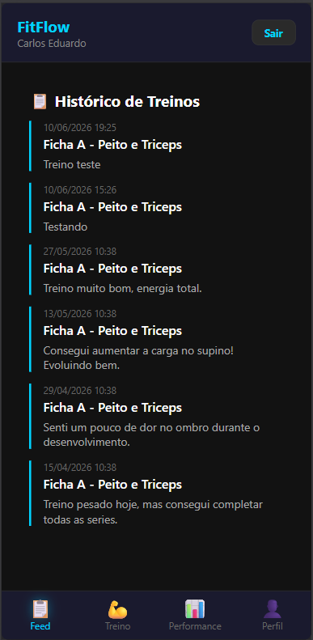

# FitFlow Manager — Documentação Técnica

## 1. Visão Geral

Sistema desktop + mobile para gestão de academias. Um instrutor ou administrador utiliza a interface JavaFX para cadastrar alunos, montar fichas de treino, acompanhar avaliações físicas e visualizar dashboards. O aluno acessa o SPA via navegador para ver sua ficha atual, registrar treinos e acompanhar seu progresso.

---

## 2. Stack Tecnológica

| Camada          | Tecnologia               | Versão              |
|-----------------|--------------------------|---------------------|
| Linguagem       | Java                     | 25                  |
| UI Desktop      | JavaFX                   | 21.0.1              |
| XML de Telas    | FXML                     | —                   |
| ORM             | Hibernate (JPA)          | 6.4.4.Final         |
| Banco           | PostgreSQL               | 42.7.3 (driver)     |
| JSON            | Gson                     | 2.10.1              |
| Build           | Maven                    | —                   |
| Servidor HTTP   | `com.sun.net.httpserver` | embutido no JDK     |
| UI Mobile       | HTML + CSS + JS (SPA)    | —                   |

---

## 3. Arquitetura

### 3.1. Camadas

```
┌──────────────────────────────────────────────────────────┐
│                   Desktop App (JavaFX)                    │
│          Academia.java → Login.fxml → PainelPrincipal     │
│                         │                                 │
│             ┌───────────┼─────────────┐                   │
│             ▼           ▼             ▼                   │
│     Dashboard  Usuarios/Exercicios  AnaliseAluno          │
│     Inicio     FichasTreino                               │
└─────────────────────┬─────────────────────────────────────┘
                      │ inicia em thread separada
                      ▼
┌──────────────────────────────────────────────────────────┐
│          Servidor HTTP Embutido (porta 8081)              │
│  ┌──────────────────┐ ┌──────────────────────────────┐    │
│  │  REST API /api/* │ │   Arquivos Estáticos (SPA)   │    │
│  └──────┬───────────┘ └──────────────────────────────┘    │
└─────────┼──────────────────────────────────────────────────┘
          │
          ▼
┌──────────────────────────────────────────────────────────┐
│                         DAOs                              │
│            UsuarioDAO · AlunoDAO · ExercicioDAO           │
│                      · TreinoDAO                          │
└──────────────────────────────────────────────────────────┘
          │
          ▼
┌──────────────────────────────────────────────────────────┐
│              Hibernate + JPA (EntityManager)              │
│                 PostgreSQL (sistema_academia)              │
└──────────────────────────────────────────────────────────┘
```



### 3.2. Organização por Domínio

Pacotes raiz sob `com.mycompany.academia`:

| Pacote  | Responsabilidade                     | Subpacotes                  |
|---------|--------------------------------------|-----------------------------|
| `core`  | Infraestrutura comum                 | `config`, `session`, `ui`, `util` |
| `admin` | Gestão de administradores e instrutores | `dao`, `model`, `ui`      |
| `aluno` | Gestão de alunos e avaliações        | `dao`, `model`, `ui`        |
| `treino`| Gestão de treinos, exercícios e séries | `dao`, `enums`, `model`, `ui` |

Cada domínio segue o padrão:
- **model/** → entidades JPA
- **dao/** → classes de acesso a dados
- **ui/** → controladores JavaFX

---

## 4. Modelo de Domínio (Entidades JPA)

### 4.1. Hierarquia `Usuario`

```
usuario (tabela base)
  ├── admin (sem colunas extras)
  ├── instrutor (coluna: cref)
  └── aluno (colunas: peso, altura, imc)
```

### 4.2. Entidades e Relacionamentos

```
aluno                ──1:N── avaliacao_fisica
aluno                ──1:N── programacao_treino
aluno                ──1:N── comentario_treino
treino               ──1:N── item_treino
treino               ──1:N── programacao_treino
treino               ──1:N── comentario_treino
exercicio            ──1:N── item_treino
item_treino          ──1:N── serie_treino
item_treino          ──1:N── item_realizado
programacao_treino   ──1:N── sessao_treino
sessao_treino        ──1:N── item_realizado
```

---

## 5. Aplicação Desktop (JavaFX)

### 5.1. Ponto de Entrada

`Launcher.main()` → `Academia.main()` → `Application.start()`:

1. Carrega `Login.fxml` como cena inicial
2. Usuário autentica via `UsuarioDAO.autenticar()`
3. Se senha for `"123456"`, força tela `TrocarSenhaObrigatoria.fxml`
4. Senão, abre `PainelPrincipal.fxml`

### 5.2. Painel Principal

É a tela principal. Possui:
- Sidebar esquerda com botões de navegação
- `StackPane areaConteudo` onde os FXML filhos são carregados
- Ao inicializar, dispara `ServidorMobile.iniciar()` em uma thread separada




### 5.3. Navegação entre telas

Cada botão na sidebar carrega um FXML diferente dentro de `areaConteudo`:

| Botão            | FXML                     | Controller                    |
|------------------|--------------------------|-------------------------------|
| Início           | `DashboardInicio.fxml`   | `DashboardInicioController`   |
| Usuários         | `Usuarios.fxml`          | `UsuariosController`          |
| Exercícios       | `Exercicios.fxml`        | `ExerciciosController`        |
| Fichas de Treino | `FichasTreino.fxml`      | `FichasTreinoController`      |
| Análise de Aluno | `AnaliseAluno.fxml`      | `AnaliseAlunoController`      |

### 5.4. Mapa completo FXML × Controller

| FXML                                | Controller                              | Localização |
|-------------------------------------|-----------------------------------------|-------------|
| `Login.fxml`                        | `LoginController`                        | `core.ui`   |
| `PainelPrincipal.fxml`              | `PainelPrincipalController`              | `core.ui`   |
| `DashboardInicio.fxml`              | `DashboardInicioController`              | `core.ui`   |
| `RecuperarSenha.fxml`               | `RecuperarSenhaController`               | `core.ui`   |
| `TrocarSenhaObrigatoria.fxml`       | `TrocarSenhaObrigatoriaController`       | `core.ui`   |
| `Usuarios.fxml`                     | `UsuariosController`                     | `aluno.ui`  |
| `FormUsuario.fxml`                  | `FormUsuarioController`                  | `admin.ui`  |
| `AnaliseAluno.fxml`                 | `AnaliseAlunoController`                 | `aluno.ui`  |
| `DetalhesTreinoRealizado.fxml`      | `DetalhesTreinoRealizadoController`      | `aluno.ui`  |
| `Exercicios.fxml`                   | `ExerciciosController`                   | `treino.ui` |
| `FormExercicio.fxml`                | `FormExercicioController`                | `treino.ui` |
| `FichasTreino.fxml`                 | `FichasTreinoController`                 | `treino.ui` |







### 5.5. Fluxo de uma tela

1. `PainelPrincipalController` chama `FXMLLoader.load(getClass().getResource("/fxml/Tela.fxml"))`
2. O FXML instancia o controller (definido em `fx:controller`)
3. JavaFX injeta campos `@FXML` automaticamente
4. `controller.initialize()` é chamado
5. O controller carrega os dados e popula a tela

---

## 6. Servidor Mobile

### 6.1. Inicialização

`ServidorMobile.iniciar()` cria um `HttpServer` na porta 8081 usando `com.sun.net.httpserver`. Registra handlers:

| Rota                      | Handler                  | Método  | Descrição                         |
|---------------------------|--------------------------|---------|-----------------------------------|
| `/api/login`              | `LoginHandler`           | POST    | Autentica aluno, retorna token    |
| `/api/ficha`              | `BuscarFichaHandler`     | GET     | Retorna ficha ativa do aluno      |
| `/api/treino/finalizar`   | `FinalizarTreinoHandler` | POST    | Finaliza treino, salva itens      |
| `/api/aluno/dashboard`    | `DashboardHandler`       | GET     | Métricas do dashboard             |
| `/api/aluno/historico`    | `HistoricoHandler`       | GET     | Feed de treinos + feedbacks       |
| `/api/aluno/perfil`       | `PerfilHandler`          | GET/PUT | Dados do perfil                   |
| `/`                       | `StaticFileHandler`      | GET     | Arquivos estáticos do mobile      |









### 6.2. Fluxo de requisição mobile

```
Navegador (celular)
    │
    ▼
StaticFileHandler → serve app.html + js/css
    │
    ▼
app.js → fetch("/api/login", {method:"POST", body:...})
    │
    ▼
ServidorMobile.LoginHandler → UsuarioDAO.autenticar()
    │
    ▼
Retorna JSON {token, id, nome, email}
    │
    ▼
app.js armazena token no sessionStorage
```

---

## 7. Frontend Mobile

### 7.1. Estrutura da Aplicação

O frontend mobile é construído com HTML, CSS e JavaScript puros — sem frameworks, sem bibliotecas externas, sem bundler. Os arquivos são servidos como estáticos pelo próprio servidor HTTP embutido.

```
FitFlow app/
├── pages/
│   ├── login.html      → tela de login do aluno
│   ├── app.html        → SPA principal (4 abas)
│   └── fluxo.html      → diagrama interativo da arquitetura
├── js/
│   ├── app.js          → lógica principal (navegação, API, estado)
│   └── fluxo.js        → lógica do diagrama interativo
└── css/
    ├── style.css       → estilos da SPA
    └── fluxo.css       → estilos do diagrama
```

### 7.2. Arquitetura do SPA

O `app.html` carrega todo o conteúdo em uma única página e utiliza **4 telas** gerenciadas por abas:

| Aba         | ID                     | Função                                                  |
|-------------|------------------------|---------------------------------------------------------|
| Feed        | `screen-feed`          | Histórico de treinos realizados com badges de novidade  |
| Treino      | `screen-treino`        | Ficha ativa, lista de exercícios, modo foco             |
| Performance | `screen-performance`   | Dashboard com métricas e gráfico semanal                |
| Perfil      | `screen-perfil`        | Dados do aluno, avaliações físicas, editar peso/altura  |

A navegação entre abas é feita via `mudarAba(tab)`, que alterna classes `.active` nas telas e nos botões de navegação inferior.

### 7.3. Gerenciamento de Estado

O estado da aplicação é mantido em variáveis globais no escopo do `app.js`:

| Variável           | Tipo     | Função                                            |
|--------------------|----------|---------------------------------------------------|
| `alunoId`          | `int`    | ID do aluno autenticado                            |
| `alunoNome`        | `string` | Nome para exibição no header                       |
| `treinoIdAtual`    | `int`    | ID da ficha de treino carregada                    |
| `exercicios`       | `array`  | Lista de exercícios da ficha ativa                 |
| `historicoRealizado`| `array` | Exercícios já executados na sessão                 |
| `exAtivoIndex`     | `int`    | Índice do exercício em foco                        |
| `serieAtual`       | `int`    | Série sendo executada no modo foco                  |
| `segundos`         | `int`    | Contador do cronômetro                              |
| `estadoTimer`      | `string` | Estado do cronômetro (PARADO / TREINANDO / DESCANSANDO) |

Dados persistentes (token, ID, nome, email) são armazenados em `localStorage` para manter a sessão entre recarregamentos da página.

### 7.4. Comunicação com o Backend

Toda comunicação é feita via `fetch()` para a API REST na mesma origem. A função `api()` centraliza as requisições:

```javascript
async function api(path, opts = {}) {
    const token = localStorage.getItem('fitflow_token');
    const headers = {
        'Content-Type': 'application/json',
        ...(token ? { 'Authorization': 'Bearer ' + token } : {})
    };
    const res = await fetch(API + path, { ...opts, headers });
    if (!res.ok) throw new Error(await res.text());
    return res.json();
}
```

### 7.5. Renderização

O conteúdo é gerado dinamicamente manipulando o `innerHTML` dos containers. Cada aba possui uma função de carregamento:

- `carregarFeed()` — busca histórico via `GET /api/aluno/historico` e renderiza cards
- `carregarTreino()` — busca ficha via `GET /api/ficha` e popula a lista de exercícios
- `carregarPerformance()` — busca métricas via `GET /api/aluno/dashboard` e atualiza estatísticas
- `carregarPerfil()` — busca dados via `GET /api/aluno/perfil` e preenche o formulário

### 7.6. Modo Foco

O modo foco é uma **tela sobreposta** que guia o aluno na execução de cada série. Seu funcionamento:

1. O aluno clica em um exercício → `abrirFoco(index)` é chamado
2. A tela de foco (`#tela-foco`) recebe classe `.active`
3. O cronômetro inicia quando o aluno clica "Iniciar Série"
4. Ao concluir, o estado muda para "DESCANSANDO" e o contador regressivo começa
5. Após o descanso, o aluno pode iniciar a próxima série ou finalizar o exercício
6. Exercícios concluídos são registrados em `historicoRealizado` e exibem checkmark na lista

O cronômetro é gerenciado por `setInterval()` com atualização a cada 1 segundo. Quando todas as séries de todos os exercícios são concluídas, o aluno pode finalizar o treino via `POST /api/treino/finalizar`.

### 7.7. Gráfico de Performance

O gráfico semanal de treinos é desenhado em um `<canvas>` utilizando a API Canvas 2D do navegador. A função `desenharGrafico()`:

1. Obtém o contexto 2D do canvas
2. Aplica `devicePixelRatio` para renderização nítida em telas Retina
3. Desenha linhas de grade horizontais
4. Renderiza barras com gradiente linear (azul claro → azul escuro)
5. Adiciona rótulos de valor e semana em cada barra
6. Redesenha em evento `resize` para responsividade

### 7.8. Responsividade

O layout utiliza **Flexbox** e unidades relativas (`%`, `vw`, `rem`) para adaptar-se a diferentes tamanhos de tela. Media queries ajustam padding, font-size e gaps em telas muito pequenas (<360px). A interface é otimizada para uso com uma mão.

---

## 8. Banco de Dados

### 8.1. Scripts auxiliares

| Arquivo                     | Função                                                                 |
|-----------------------------|------------------------------------------------------------------------|
| `schema.sql`                | Cria o banco completo (13 tabelas) com `ON DELETE CASCADE` em todas as FKs |
| `persistence.xml.example`   | Template de configuração do banco (copiar e ajustar credenciais)       |
| `config.properties.example` | Template da chave da GIPHY API (copiar e adicionar a chave)            |

---

## 9. Segurança

- **Senhas** armazenadas em texto **puro** no banco
- `Aluno` **não pode** acessar o desktop
- `Admin` pode gerenciar usuários; `Instrutor` tem acesso limitado
- **Primeiro login** com senha `"123456"` força troca de senha (`TrocarSenhaObrigatoriaController`)
- **Recuperação de senha** simulada em 3 etapas

---

## 10. Build e Execução

### 10.1. Pré-requisitos

- JDK 25
- Maven 3.8+
- PostgreSQL rodando com banco `sistema_academia` criado

### 10.2. Comandos

```bash
# Compilar e executar
mvn clean compile exec:java

# Ou gerar JAR e executar
mvn clean package
java -jar target/academia-1.0-SNAPSHOT.jar
```

O servidor mobile inicia automaticamente na porta 8081 junto com a interface desktop.

---

## 11. Estrutura de Arquivos

```
src/main/java/com/mycompany/academia/
├── Academia.java                     # Entry point JavaFX
├── Launcher.java                     # Wrapper alternativo
├── admin/
│   ├── dao/UsuarioDAO.java
│   ├── model/{Admin,Instrutor,Usuario}.java
│   └── ui/FormUsuarioController.java
├── aluno/
│   ├── dao/AlunoDAO.java
│   ├── model/{Aluno,AvaliacaoFisica}.java
│   └── ui/{AnaliseAlunoController,
│            DetalhesTreinoRealizadoController,
│            UsuariosController}.java
├── core/
│   ├── config/{GifSearchService,JPAUtil,SeedData,
│                ServidorMobile,SetupBanco}.java
│   ├── session/{SessaoTreino,SessaoUsuario}.java
│   ├── ui/{DashboardInicioController,LoginController,
│            PainelPrincipalController,
│            RecuperarSenhaController,
│            TrocarSenhaObrigatoriaController}.java
│   └── util/TableUtils.java
└── treino/
    ├── dao/{ExercicioDAO,TreinoDAO}.java
    ├── enums/ObjetivoTreino.java
    ├── model/{ComentarioTreino,Exercicio,ItemRealizado,
               ItemTreino,ProgramacaoTreino,SerieTreino,
               Treino}.java
    └── ui/{ExerciciosController,
             FichasTreinoController,
             FormExercicioController}.java

src/main/resources/
├── META-INF/persistence.xml
├── fxml/ (12 arquivos .fxml)
└── FitFlow app/
    ├── pages/{app.html,fluxo.html,login.html}
    ├── js/{app.js,fluxo.js}
    └── css/{style.css,fluxo.css}
```
